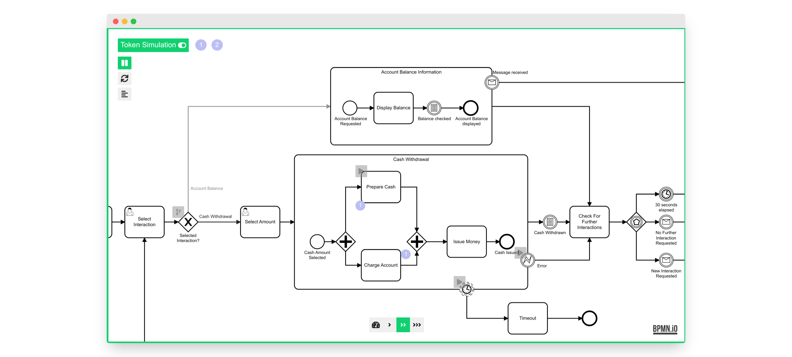

# bpmn-js Token Simulation 汉化版

[](https://github.com/bpmn-io/bpmn-js-token-simulation/actions?query=workflow%3ACI)

一个npnm 模拟流转流程的模拟器,基于bnpm使用,只是简单的汉化（0.27.0版）

[](https://bpmn-io.github.io/bpmn-js-token-simulation/modeler.html?e=1&pp=1)

Try it on the [classic booking example](https://bpmn-io.github.io/bpmn-js-token-simulation/modeler.html?e=1&pp=1&diagram=https%3A%2F%2Fraw.githubusercontent.com%2Fbpmn-io%2Fbpmn-js-token-simulation%2Fmaster%2Ftest%2Fspec%2Fbooking.bpmn) or checkout the [full capability demo](https://bpmn-io.github.io/bpmn-js-token-simulation/modeler.html?e=1&pp=1&diagram=https%3A%2F%2Fraw.githubusercontent.com%2Fbpmn-io%2Fbpmn-js-token-simulation%2Fmaster%2Fexample%2Fresources%2Fall.bpmn).

## Installation

Install via [npm](http://npmjs.com/).

```
npm install bpmn-js-simulation-localization
```

## Usage

Add as additional module to [bpmn-js](https://github.com/bpmn-io/bpmn-js).

### Modeler

```javascript
import BpmnModeler from 'bpmn-js/lib/Modeler';
import TokenSimulationModule from 'bpmn-js-simulation-localization';

const modeler = new BpmnModeler({
  container: '#canvas',
  additionalModules: [
    TokenSimulationModule
  ]
});
//当前css 也需要引入
@import "bpmn-js-simulation-localization/assets/css/bpmn-js-token-simulation.css";
@import "bpmn-js-simulation-localization/assets/css/font-awesome.min.css";
@import "bpmn-js-simulation-localization/assets/css/normalize.css";
```

### Viewer

```javascript
import BpmnViewer from 'bpmn-js/lib/NavigatedViewer';
import TokenSimulationModule from 'bpmn-js-simulation-localization/lib/viewer';

const viewer = new BpmnViewer({
  container: '#canvas',
  additionalModules: [
    TokenSimulationModule
  ]
});
```

## Build and Run

Prepare the project by installing all dependencies:

```sh
npm install
```

Then, depending on your use-case you may run any of the following commands:

```sh
# build the library and run all tests
npm run all

# run the full development setup
npm run dev

# spin up the example
npm run start:example
```

## Additional Resources

* [Making of token simulation](https://nikku.github.io/talks/2021-token-simulation/presentation.html) - The case for token simulation and how it builds on top of [bpmn-js](https://github.com/bpmn-io/bpmn-js)
* [Token simulation internals](https://nikku.github.io/talks/2021-token-simulation-internals/presentation.html) - Detailed walk through the simulators core
* [Camunda Modeler Token Simulation plug-in](https://github.com/bpmn-io/bpmn-js-token-simulation-plugin) - Token simulation for [Camunda](https://camunda.com/) users


## Supported Elements

* Boundary Event (attached to Subprocess)
* Call Activity
* End Event
* Event-based Gateway
* Exclusive Gateway
* Intermediate Catch Event
* Intermediate Throw Event
* Parallel Gateway
* Start Event
* Task
* Terminate End Event
* Subprocess

以上事件没有详细说明,感谢原插件的开发者,原插件链接:https://github.com/bpmn-io/bpmn-js-token-simulation

## Licence

MIT
